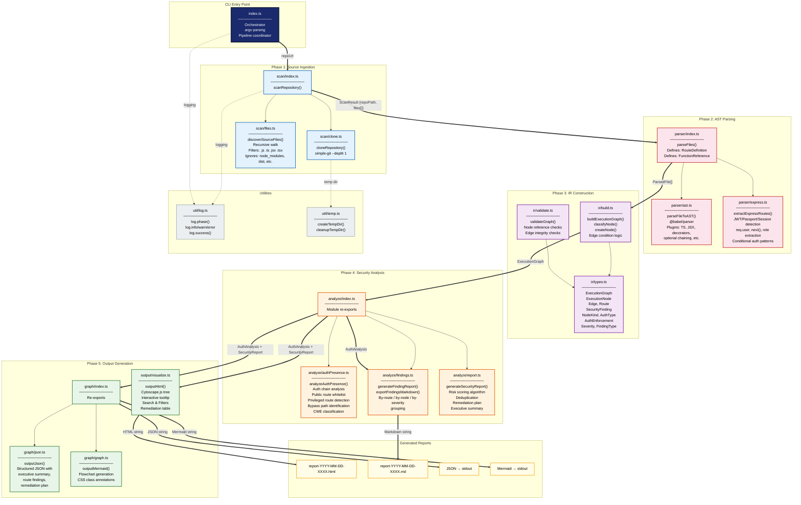
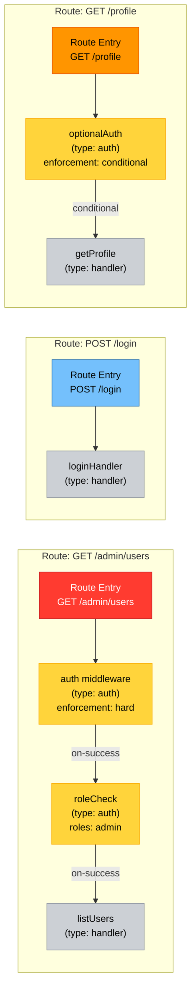
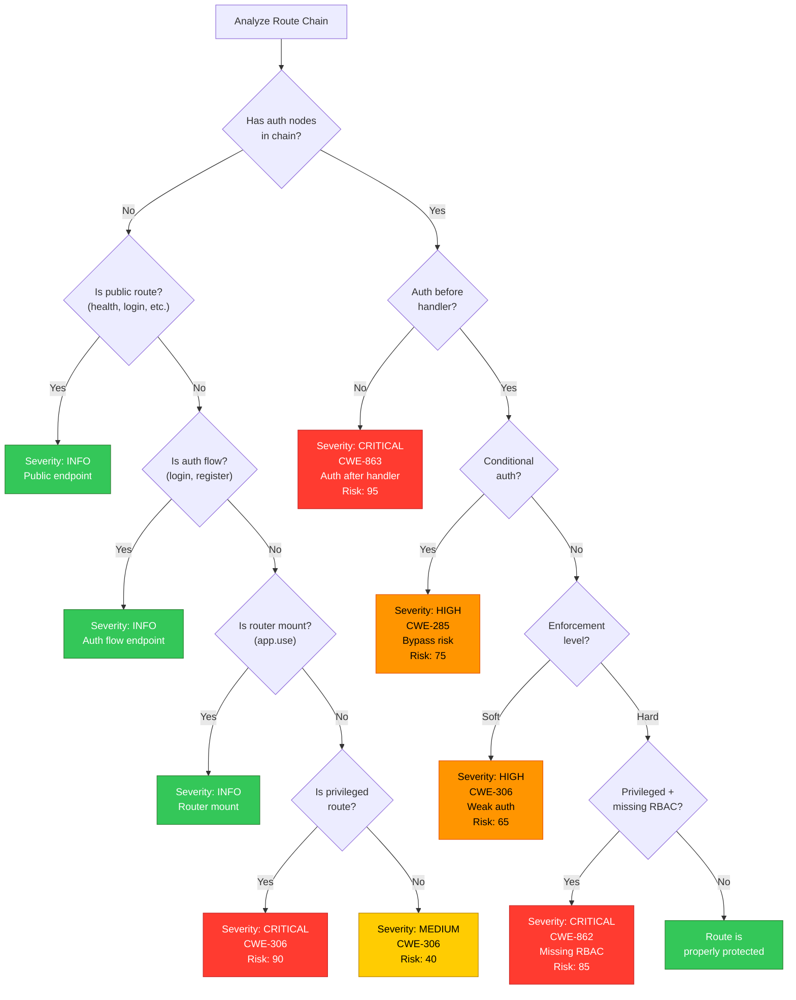

# Web-Wreck — Architecture Diagram

## System Overview



---

## Data Flow Summary

```mermaid
flowchart LR
    A["GitHub URL"] --> B["Clone<br/>(simple-git)"]
    B --> C["File Discovery<br/>(.js/.ts/.jsx/.tsx)"]
    C --> D["Babel AST<br/>Parsing"]
    D --> E["Express Route<br/>Extraction"]
    E --> F["IR Graph<br/>Construction"]
    F --> G["Auth Presence<br/>Analysis"]
    G --> H["Security<br/>Reporting"]
    H --> I["HTML / MD /<br/>JSON / Mermaid"]

    style A fill:#e3f2fd,stroke:#1565c0,color:#000
    style B fill:#e3f2fd,stroke:#1565c0,color:#000
    style C fill:#e3f2fd,stroke:#1565c0,color:#000
    style D fill:#fce4ec,stroke:#c62828,color:#000
    style E fill:#fce4ec,stroke:#c62828,color:#000
    style F fill:#f3e5f5,stroke:#7b1fa2,color:#000
    style G fill:#fff3e0,stroke:#e65100,color:#000
    style H fill:#fff3e0,stroke:#e65100,color:#000
    style I fill:#e8f5e9,stroke:#2e7d32,color:#000
```



---

## IR Graph Structure (Execution Model)



---

## Security Analysis Decision Tree



---

## File System Layout

```
web-wreck/
├── backend/
│   ├── src/
│   │   ├── index.ts              ← CLI entry point & pipeline orchestrator
│   │   ├── scan/
│   │   │   ├── index.ts          ← scanRepository() orchestrator
│   │   │   ├── clone.ts          ← Git clone (simple-git)
│   │   │   └── files.ts          ← Recursive file discovery
│   │   ├── parser/
│   │   │   ├── index.ts          ← parseFiles() + type definitions
│   │   │   ├── ast.ts            ← Babel AST parsing
│   │   │   ├── express.ts        ← Express route extraction
│   │   │   └── resolve.ts        ← Cross-file reference resolution
│   │   ├── ir/
│   │   │   ├── types.ts          ← All IR type definitions
│   │   │   ├── build.ts          ← ExecutionGraph builder
│   │   │   └── validate.ts       ← Graph structural validation
│   │   ├── analyze/
│   │   │   ├── index.ts          ← Module re-exports
│   │   │   ├── authPresence.ts   ← Auth analysis engine
│   │   │   ├── findings.ts       ← Finding management
│   │   │   └── report.ts         ← Security report generator
│   │   ├── graph/
│   │   │   ├── index.ts          ← Re-exports
│   │   │   ├── json.ts           ← JSON output serialization
│   │   │   └── graph.ts          ← Mermaid diagram generation
│   │   ├── output/
│   │   │   └── visualize.ts      ← HTML + Cytoscape visualization
│   │   └── util/
│   │       ├── graph.ts          ← Graph traversal utils (DFS, etc.)
│   │       ├── log.ts            ← Logging utilities
│   │       └── temp.ts           ← Temp directory management
│   ├── dist/                     ← Compiled JS output
│   ├── package.json
│   ├── tsconfig.json
│   ├── ARCHITECTURE.md           ← This architecture document
│   └── SETUP.md                  ← Setup and usage guide
├── web-wreck-output/             ← Generated reports
│   └── report-YYYY-MM-DD-XXXX.html
└── package.json                  ← Root dependencies
```
